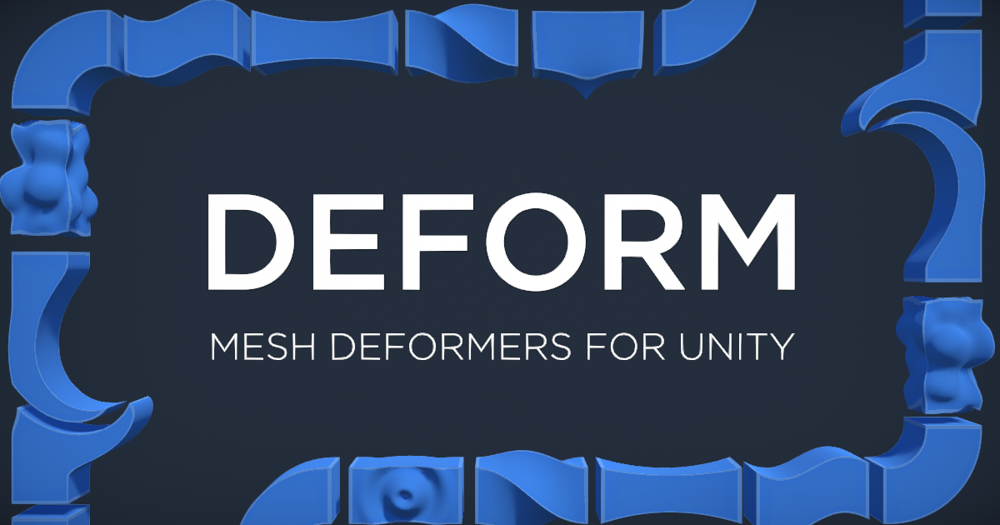

A fully-featured deformer system for [Unity](https://unity3d.com/). Deform is multi-threaded with the Job System, compiled with Burst and calculations are done using the Mathematics library.

*Also available on the [Asset Store.](https://assetstore.unity.com/packages/tools/modeling/deform-148425)*

## Features
⚡ Lightning fast! 
🧶 Fully multi-threaded! 
⭐ 40+ deformers! 
💾 Meshes can be saved! 
🔧 Easily extendable! 
🌐 Works in worldspace! 
🎨 Custom editors and handles! 

## [Documentation](https://github.com/keenanwoodall/Deform/wiki)
* [Installation](https://github.com/keenanwoodall/Deform/wiki/Installation) (Important)
* [Getting Started](https://github.com/keenanwoodall/Deform/wiki/Getting-Started)
* [Creating a Custom Deformer](https://github.com/keenanwoodall/Deform/wiki/Creating-A-Custom-Deformer)
* [Optimization Tips](https://github.com/keenanwoodall/Deform/wiki/Optimization-Tips)

## FAQ
> Does Deform work with the new prefab system?

Yes. Deform works seamlessly with nested prefabs and prefab variants.

> Are skinned mesh renderers supported?

Yes. However because of how Unity handles skinned mesh renderers; the mesh cannot be modified after its bones are animated. This means that animations to the skinned mesh renderer are applied *after* Deform modifies the mesh; which is often not the desired effect. Read more [here](https://github.com/keenanwoodall/Deform/wiki/WTF-Is-Up-Skinned-Mesh-Renderers).

> I'm getting an error about read/write permissions. How do I fix it?

This means you have a Deformable component on a mesh that doesn't have read/write permissions enabled. The offending Deformable component should have a "Fix It" button in the inspector that will change the import settings, but on older versions of Deform you'll have to select the offending mesh in your Project window and enable Read/Write permissions in its import settings manually.

> Do deformers have to be on the object they are deforming?

No. Because deformables require deformers be added manually, they can be anywhere in the scene and on any game object.

> Can deformables share deformers?

Yes. You can create a single deformer and add it to multiple deformables.

> How do deformables handle instancing?

Each deformable has it's own unique mesh.

## Limitations
Deform runs on the CPU. While it *is* incredibly fast, you should not expect to get performance comparable to vertex shaders. Because meshes are modified on the CPU each mesh has to be unique. This means that, unless dynamically batched (which comes with its own performance costs), each mesh will require a new draw call. Deform is not meant to be used at a massive scale. If you need to deform an entire world, tons of meshes, or an incredibly high poly model use vertex shaders. 

**tldr:** Use shaders if you need speed, use Deform if you need modularity and ease-of-use.

## Acknowledgments
* Thanks to [Thomas Ingram](https://twitter.com/vertexxyz) for going the extra-mile to help with editor scripting.
* Thanks to [Alexander Ameye](https://twitter.com/alexanderameye), [William Besnard](https://twitter.com/BillSansky), [Raphael Herdlicka](https://www.herdlicka.net/) and [David Carney](https://twitter.com/thedavidcarney) for beta testing and giving crucial feedback.

Additional massive thanks to the following contributors for helping develop Deform into the best tool it can be: [sabresaurus](https://github.com/sabresaurus), [Brullworfel](https://github.com/Brullworfel), [favoyang](https://github.com/favoyang), and [HitCache](https://github.com/HitCache)

I love seeing creative and cool uses of this tool. If you make something you're proud of I'd be honored if you showed it to me!

You can find me on the interwebs at these addresses: 
[email](mailto:keenanwoodall@gmail.com) | [twitter](https://twitter.com/keenanwoodall) | [website](http://keenanwoodall.com)
 Feel free to reach out about anything!

#### If you like Deform, please consider donating!

